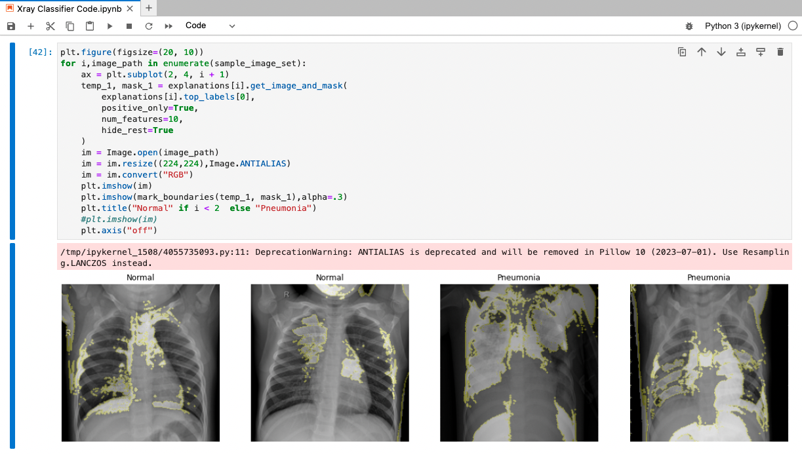

# ML Ops with Airflow, Tensorflow and MLFlow

 This repo walks through the steps necessary to create and operate an image classifier using Apache Airflow. This includes the DAG and required code to run it, steps to build the kubernetes resources and some helpful hints and tips to apply this into your own environment. 


## Quickstart Guide
```Dockerfile
ENV CLUSTER_CONTEXT=arn:aws:eks:eu-central-1:559345414282:cluster/jf-eks \
    STORAGE_PATH=/efs \
    RAY_SERVER=aec1a277e48474b80ad9a713faf74991-411668911.eu-central-1.elb.amazonaws.com \
    MLFLOW_SERVER=a98c118fb63bc44ee92b85511d2bcfb2-2060505287.eu-central-1.elb.amazonaws.com \
    PVC_NAME=efs-claim
```

## ML Application Overview




## Kubernetes Cluster Architecture


## Tooling Used
* Astro CLI
* Apache Airflow

## Code Overview


## Deploy Project


