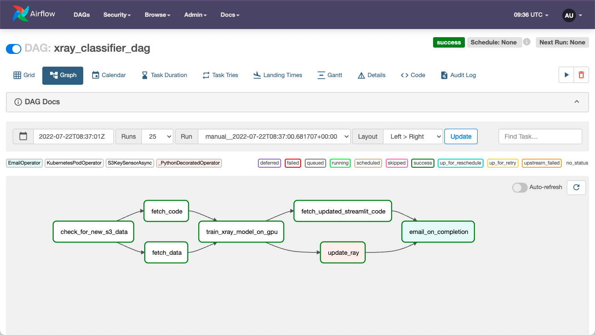
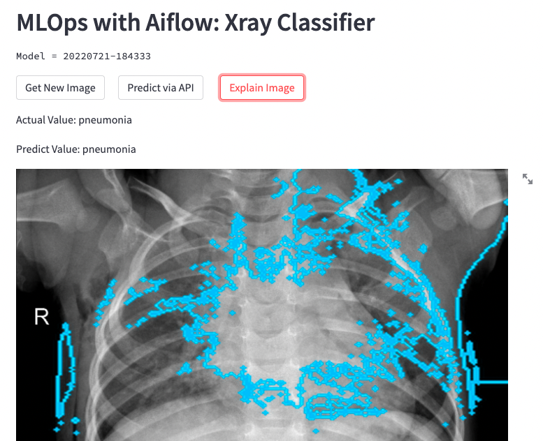
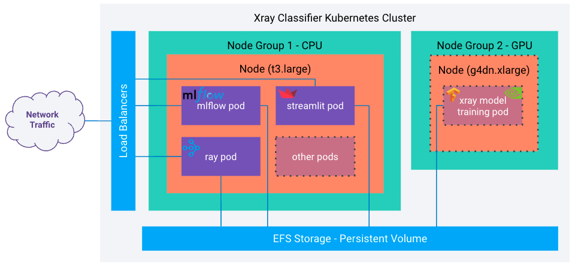
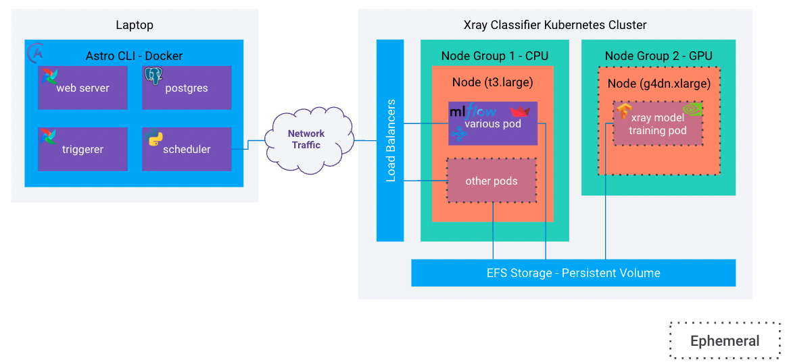
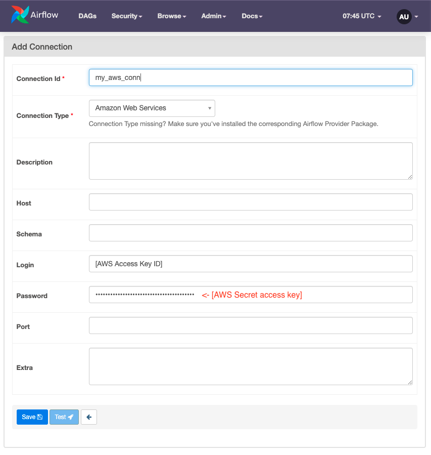

# ML Ops with Airflow, Tensorflow and MLFlow

 This repo walks through the steps necessary to create and operate an image classifier using Apache Airflow. This includes the DAG and required code to run it, steps to build the kubernetes resources and some helpful hints and tips to apply this into your own environment. This repo provides the code for [this webinar](https://www.astronomer.io/events/webinars/using-airflow-with-tensorflow-mlflow). The webinar goes into more detail about the code, tooling choices, general ML Ops with Airflow stuff and will help with understanding more of this repo.



## ML Application Overview
The end goal of this project is to deploy a Machine Learning application into production and automate model training when new data is available using Airflow. The actual ML Application is relatively simple in that it uses a pre-trained model and a well documented framework. This will build a Neural Network based image classifier that will predict if the lungs in an xray image have pneumonia or not. The dataset comes from [Kaggle](https://www.kaggle.com/datasets/paultimothymooney/chest-xray-pneumonia) and the process uses the [transfer learning example](https://www.tensorflow.org/tutorials/images/transfer_learning) from Tensorflow. There are some changes that are model to optimise for 2 classes and to add in a [Lime Image Explainer](https://github.com/marcotcr/lime) option. You can see the changes in the included [Notebook](Xray_Classifier_Notebook.ipynb).

The basic process is that is implemented is:
* Check an S3 bucket location to see if there are new files with an [S3 Async Sensor](https://registry.astronomer.io/providers/astronomer-providers/modules/s3keysizesensorasync)
* If there is new data, download the files and updated training code to a shared storage
* Create a GPU node that can be used to train the model with Tensorflow and tracked with MLFlow
* Update a [Ray serve](https://www.ray.io/ray-serve) endpoint with the new model
* Update a streamlit application to use the new model



This creates a managed ML model that is updated when additional data becomes available, all managed with Airflow.

## Project Setup
This guide assumes you will be running on an AWS EKS cluster. EKS isn't a hard requirement for this project, but this repo was made with EKS. AKS, GKE etc will also work, but you will need to adapt the kubernetes specific requirements accordingly. The other assumption is that you will be using Astronomer's [astro cli](https://docs.astronomer.io/astro/cli/overview) to run Airflow locally.

### Step 1 - Set Up an EKS Cluster with Required Services
The EKS cluster consists for two node groups, one that uses smaller CPU only nodes (t3.large) for running the required services (MLFlow, Ray and Streamlit) that auto-scales to a minimum of 1 node and another that uses GPU nodes (g4dn.xlarge) that scales to zero when not in use. Most of the pods that are created will need access to a shared PersistentVolume to store image data and trained model artifacts. 

The required services need to run continuously and be accessible from your local machine to the cluster, on all the ports that are needed.

A more detailed setup guide for the EKS cluster used for this repo is available [here](kubernetes_docs/EKS%20Cluster.md). 



Before moving to step 2 you need to have:
* The cluster context from your `kubectl` config file
* The exposed IPs/hostnames for the MLFlow, Ray and Streamlit pods
* The PersistentVolumeClaim name for the shared storage PersistentVolume

### Step 2 - Run Local Airflow Deployment
For this step you will need to have the Astronomer [astro cli](https://docs.astronomer.io/astro/cli/overview) installed along with some form of Docker engine (e.g. Docker Desktop). Clone this project into local folder. From there you need to add your kubernetes authentication details.

#### 2.1 Copy `aws` cli and `kubectl` Config Details
Copy your aws cli credential files (config + credentials) into the `include/.aws/` directory. These files are usually in `~/.aws/`. You may have several sets of credentials, so you can delete the ones you don't need before copying over.
```
$ tree ~/.aws/
/Users/jeff/.aws/
├── config
└── credentials
0 directories, 2 files
```

You also need to copy the `KUBECONFIG` file for the cluster ino the `include/` directory. The is usually located at `~/.kube/config`. Again you may have multiple cluster contexts in that file, so you can delete the ones you don't need before copying over.

These files will be copied into the Docker image used for the local deployment and are *not* pushed to the git repo, so the credentials will remain relatively safe.

#### 2.2 Update the `Dockerfile`
Next open the `Dockerfile` file and update the environment variables with the information you created in step 1.

```Dockerfile
ENV CLUSTER_CONTEXT=[your cluster context] \
    STORAGE_PATH=/[root path for the shared storage e.g. /efs] \
    RAY_SERVER=[hostname / ip for the Ray server] \
    MLFLOW_SERVER=[hostname / ip for the MLFlow server] \
    PVC_NAME=efs-claim
```

Once you've updated the Dockerfile and added your credentials to the project, you can start up the local Airflow UI but running `astro dev start` in the project directory. 



#### 2.3 Create AWS Connection
For the `S3KeySensorAsync` to connect to AWS and check the S3 bucket, you need to add your AWS connection details to Airflow. This is different to the AWS config file from step 2.1, although it does contain the same info. In the Airflow UI, got to `Admin > Connections` and add a new connection. Fill in your AWS details as follows, make sure to use the same `my_aws_conn` connection ID.



#### 2.4 Configure Email
There are a couple of ways of getting Airflow to send an email, either as an explicit task or as an alert for failed tasks. The Astro documentation recommends a [few approaches](https://docs.astronomer.io/astro/airflow-alerts#configure-airflow-email-alerts). I used my gmail account along with a [Google App Password](https://support.google.com/accounts/answer/185833?hl=en-GB). The easiest way to configure this with the Astro cli is to add an `airflow.cfg` file to the project directory with the following details:

```Conf
[smtp]
smtp_host = smtp.gmail.com
smtp_starttls = True
smtp_ssl = False
smtp_user = [Your Gmail user]@gmail.com
smtp_password = [You Google App password]
smtp_port = 587
smtp_mail_from = fletch.jeff@gmail.com
smtp_timeout = 30
smtp_retry_limit = 5
```

This becomes the default email connection for the local Airflow instance.

#### 2.5 Trigger the DAG
If you have completed all the previous steps, you should be good to go. Trigger the DAG in the local Airflow UI and marvel at the operations of these learning machines!

### Step 3 - Push to Production
Once you have everything working locally, the next step is to push into production. The assumptions from here are that:
1. You already have an Astro account, a cluster and a [deployment](https://docs.astronomer.io/astro/create-deployment)
2. The EKS/k8s cluster from step 1 can be reached from your Astro deployment

#### 3.1 Deploy to Astro cluster
To deploy the code to your deployment, in the project directory run `astro deploy`. More help on this is available in the astro [documentation](https://docs.astronomer.io/astro/deploy-code).

#### 3.2 Create AWS Connection
You need to create the same AWS connection you did for the local configuration in [step 2.3](#23-create-aws-connection)

#### 3.3 Configure Email
For production it is not recommended to use your gmail account, so you should follow one of the Astronomer recommended email alert [implementations](https://docs.astronomer.io/astro/airflow-alerts#configure-airflow-email-alerts).
